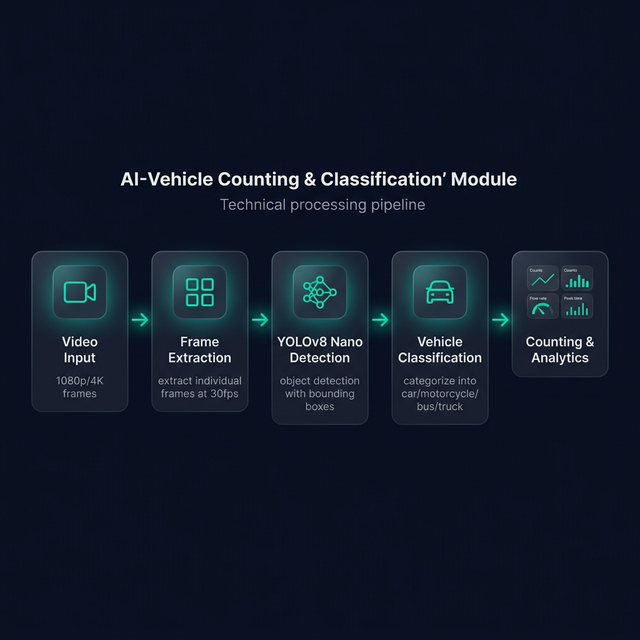

# AI-Based Integrated Video Analytics System — v2.6 (Platinum Edition)

A high-performance, enterprise-grade AI video analytics suite designed for real-time security, behavioral intelligence, and automated threat detection. This system leverages state-of-the-art Deep Learning models (YOLOv8, YOLOv8-Pose, DeepFace) to provide a unified intelligence layer over standard video feeds.



---

## 🌟 NEW UPDATE: Instant Fight Detection & UI Optimization (v2.6)

The latest update focuses on **Latency Reduction** and **UI Fluidity**, ensuring critical threats are flagged and displayed without delay.

### 🥊 1. Instant Fighting Detection
*   **⚡ Zero-Latency Triggers**: Implementation of "Fast-Track" logic for high-confidence physical conflicts (Score > 0.60), bypassing confirmation frames for instant alerts.
*   **🎯 Enhanced Pose Sensitivity**: Lowered keypoint confidence thresholds to 0.35 and optimized elbow/wrist vector analysis to catch aggressive movements (strikes/pushes) in blurred frames.
*   **🔄 Sticky Alert Persistence**: Detections now feature a 4-second "sticky" state to maintain tracking during complex, high-motion struggles.

### 🎨 2. Premium UI & Layout Optimization
*   **📱 Responsive Module Navigation**: Re-engineered the module tab system with smooth horizontal scrolling and hidden scrollbars, preventing "tab collapse" on smaller displays.
*   **🏗️ Structural Integrity Fixes**: Resolved critical HTML/JS rendering bugs that caused results panels to distort during live analysis.
*   **📈 Priority Sorting**: Live behavioral logs now automatically bubble-up critical events (Fighting/Falls) to the top of the feed.

### 📧 3. Automated Alerting System
*   **✉️ Gmail Integration**: Automated SMTP-based email alerts sent for high-priority threats (Weapons, Fights, Falls).
*   **🛡️ Alert Debouncing**: Intelligent cooldown mechanism to prevent email flooding while maintaining 24/7 monitoring.

---

## 🚀 Core Features

### 1. Intelligent Vehicle Analytics
*   **High-Precision Detection**: YOLOv8-Large for cars, bikes, buses, and trucks.
*   **Speed Estimation**: Centroid tracking + perspective calibration for KM/H metrics.
*   **ANPR (Automatic Number Plate Recognition)**: 
    *   Indian Standard Plate detection (Regex-based validation).
    *   **Blacklist Integration**: Automated alerts for flagged vehicles.

### 2. Facial Recognition & Modern Identity
*   **RetinaFace + Facenet512**: State-of-the-art face localization and 512-dim embedding extraction.
*   **Attribute Intelligence**: Detects Age, Gender, Emotion, and Race.
*   **Whitelist/Blacklist Management**: Web-based console to manage authorized personnel and "Unmatched Persons".

### 3. Crowd Intelligence
*   **Density Mapping**: Regional density estimation (Low to Very High).
*   **Thermal Heatmaps**: Real-time spatial distribution overlays.
*   **Gender Distribution**: AI-based male/female ratio tracking.

---

## 🛠️ Architecture & Performance
*   **Compute Engine**: Parallelized execution via `ThreadPoolExecutor` (6+ concurrent AI workers).
*   **Night Vision 2.0**: Advanced CLAHE + Gamma correction for low-light frame enhancement.
*   **GPU/CUDA Acceleration**: Automatically leverages NVIDIA RTX (e.g., RTX 4060) for near-instant inference.
*   **Hardware Failover**: Graceful CPU multi-threading fallback for non-GPU environments.

---

## 📦 Installation & Setup

1. **Clone & Navigate**
   ```bash
   git clone https://github.com/abhinai2244/AI-Based-Integrated-Video-Analytics-System.git
   cd AI-Based-Integrated-Video-Analytics-System
   ```
2. **Install Deep Learning Stack**
   ```bash
   pip install -r requirements.txt
   ```
3. **Environment Setup**
   Ensure `SMTP_PASS` or Gmail App Passwords are set for email alerts.
4. **Launch Application**
   ```bash
   python app.py
   ```

---

## 📁 Updated Project Structure
```text
├── app.py                # Main Flask Orchestrator
├── modules/
│   ├── behavior_analysis.py  # Pose-based Fall/Fight detection (New)
│   ├── weapon_detection.py   # Enhanced Threat detection (Updated)
│   ├── face_recognition_module.py # Identity & Analytics
│   ├── anpr.py               # License Plate AI
│   └── people_counter.py     # Crowd Intelligence
├── templates/            # Glassmorphic UI Pages (Premium)
├── security_utils.py     # Encryption & Gmail Alerting
└── requirements.txt      # AI Dependencies (Ultralytics, DeepFace, etc.)
```

---

## 📄 Developers
Lead Developer: **Abhinai Reddy**
AI Integration Specialist: **Antigravity AI**
